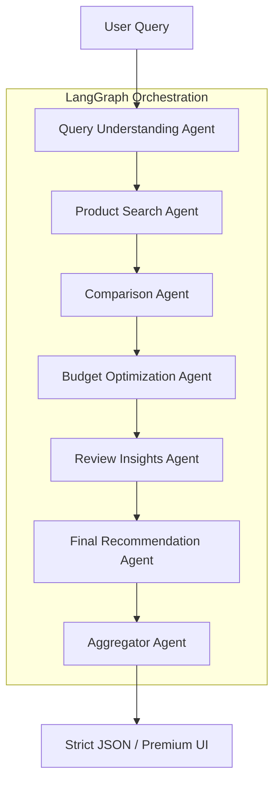

<div align="center">
  

  <h3>🛍️ Your Premium Agentic Shopping Assistant</h3>

  <p align="center">
    
    
    
    
    
    
  </p>

  <p><b>A multi-agent pipeline designed to search, compare, and recommend products with clinical precision.</b></p>
</div>

---

## 🌟 Introduction

**ShopMind AI** is a state-of-the-art agentic shopping assistant that leverages the power of **LangGraph** and **Groq** to automate the product research process. Unlike traditional search engines, ShopMind AI uses a 7-agent pipeline to understand your intent, browse the web in real-time via Tavily, compare technical specifications, optimize for your budget, and analyze user sentiment—all to deliver a single, data-backed recommendation.

Whether you're looking for the best smartphone under a budget or a professional gaming laptop, ShopMind AI handles the heavy lifting, providing you with a crisp, structured, and visually stunning comparison dashboard.

---

## 🏗️ Architecture



---

## 📁 Project Structure

```bash
shopping_assistant/
├── agents/
│   ├── schemas.py            # Pydantic models (strict output)
│   ├── llm.py                # Groq LLM configuration
│   ├── query_agent.py        # Agent 1: Understanding intent
│   ├── search_agent.py       # Agent 2: Real-time product lookup
│   ├── comparison_agent.py   # Agent 3: Feature & Value analysis
│   ├── budget_agent.py       # Agent 4: Budget filtering
│   ├── review_agent.py       # Agent 5: Sentiment & Review analysis
│   ├── recommendation_agent.py # Agent 6: Decision making
│   └── aggregator_agent.py   # Agent 7: Final data formatting
├── graph/
│   └── shopping_graph.py     # LangGraph workflow orchestration
├── tools/
│   └── search_tools.py       # Tavily API integration & caching
├── main.py                   # CLI Entry point
├── streamlit_app.py          # Premium Dashboard UI
├── ROADMAP_IMPLEMENTATION.md # Project implementation guide
├── requirements.txt          # Dependencies
└── README.md                 # Project documentation
```

---

## ⚡ Quick Start

### 1. Clone & Setup
```bash
git clone https://github.com/KaustavWayne/shopping_assistant.git
cd shopping_assistant
```

### 2. Install Dependencies
```bash
# It is recommended to use a virtual environment
python -m venv venv
source venv/bin/activate  # On Windows: venv\Scripts\activate
pip install -r requirements.txt
```

### 3. Configure API Keys
Create a `.env` file in the root directory:
```env
GROQ_API_KEY=your_groq_key
TAVILY_API_KEY=your_tavily_key
```

### 4. Launch the App
```bash
streamlit run streamlit_app.py
```

---

## 🔑 Key Features

- **Multi-Agent Collaboration**: 7 specialized agents working in a stateful graph.
- **Ultra-Fast Performance**: Powered by Groq's LPU™ Inference Engine.
- **Real-Time Data**: Live web searching using Tavily API.
- **Pydantic Validation**: Guaranteed structured outputs for reliable UI rendering.
- **Premium UI**: Sleek, glassmorphism-inspired Streamlit dashboard.

---

## �‍💻 Author

<div align="left">
  <h3>Kaustav Roy Chowdhury</h3>
  <p><i>Building Intelligent Agentic Systems</i></p>

  <a href="https://www.linkedin.com/in/kaustavroychowdhury">
    
  </a>
  <a href="https://github.com/KaustavWayne">
    
  </a>
</div>

---

<div align="center">
  <p>Built with ❤️ using LangGraph & Groq</p>
</div>
